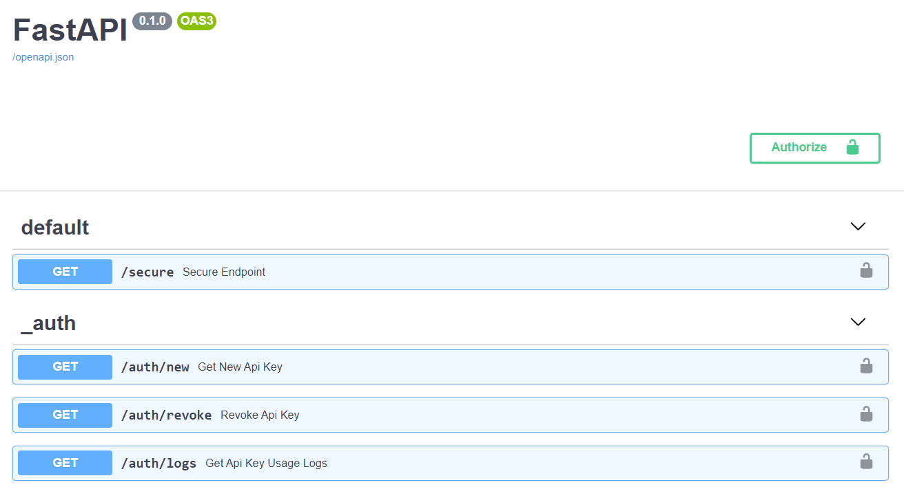
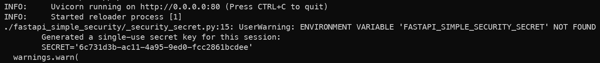
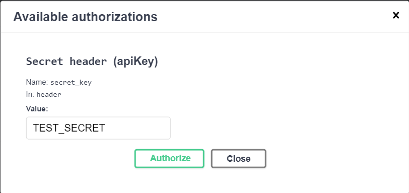
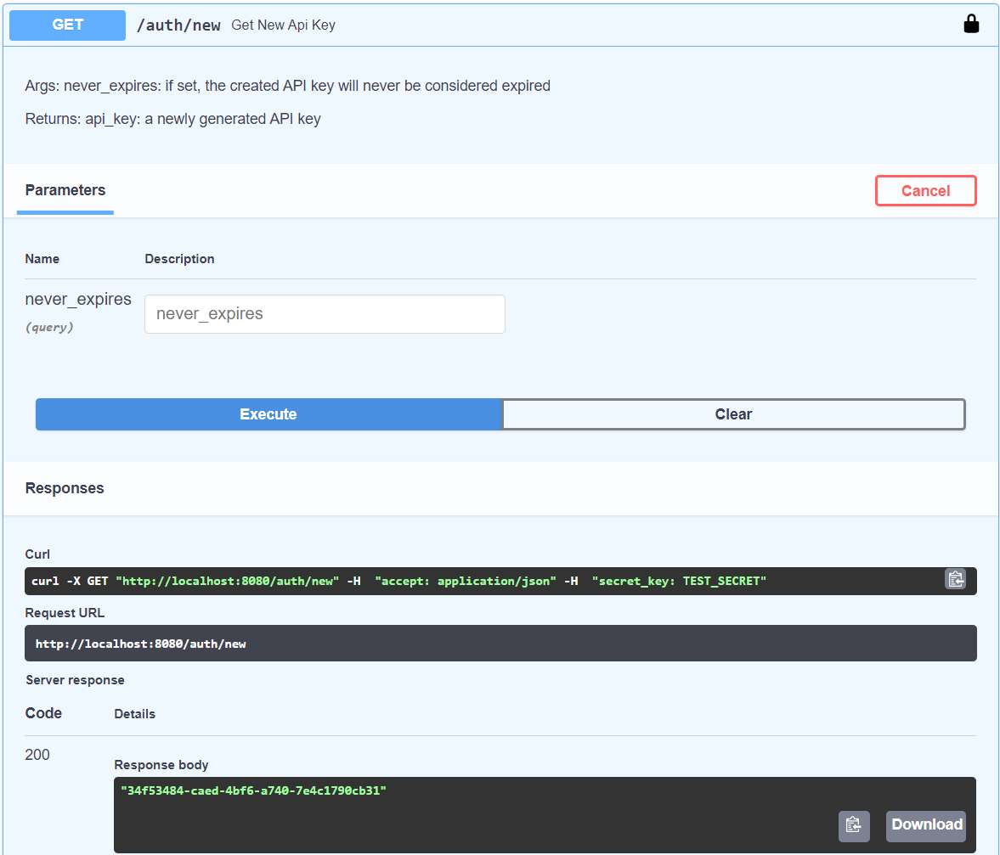
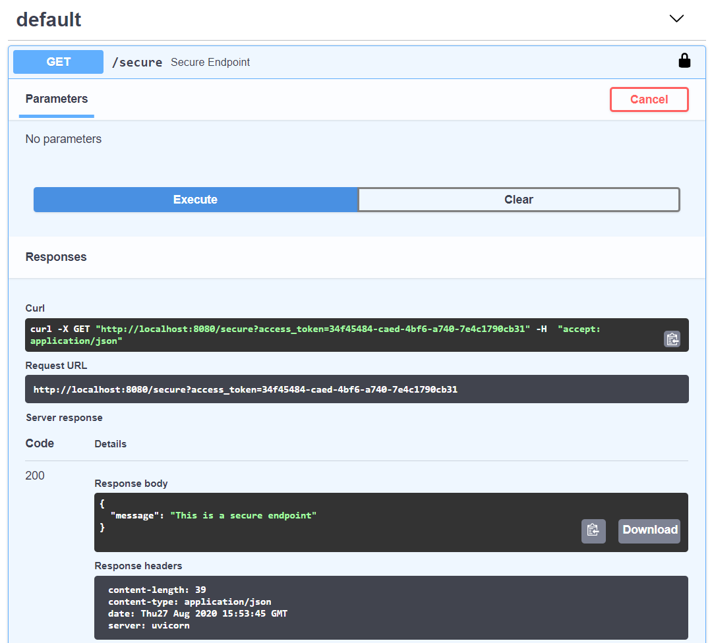

# FastAPI simple security

[](https://codecov.io/github/mrtolkien/fastapi_simple_security)
[](https://github.com/mrtolkien/fastapi_simple_security/actions/workflows/pr_python_tests.yml)
[](https://github.com/mrtolkien/fastapi_simple_security/actions/workflows/push_sanity_check.yml)
[](https://github.com/psf/black)
[![pre-commit enabled][pre-commit badge]][pre-commit project]

[pre-commit badge]: <https://img.shields.io/badge/pre--commit-enabled-brightgreen?logo=pre-commit&logoColor=white>
[pre-commit project]: <https://pre-commit.com/>

API key based security package for FastAPI, focused on simplicity of use:

- Full functionality out of the box, no configuration required
- API key security with local `sqlite` backend, working with both header and query parameters
- Default 15 days deprecation for generated API keys
- Key creation, revocation, renewing, and usage logs handled through administrator endpoints
- No dependencies, only requiring `FastAPI` and the python standard library

This module cannot be used for any kind of distributed deployment. It's goal is to help have some basic security features
for simple one-server API deployments, mostly during development.

## Installation

`pip install fastapi_simple_security`

### Usage

### Creating an application

```python
from fastapi_simple_security import api_key_router, api_key_security
from fastapi import Depends, FastAPI

app = FastAPI()

app.include_router(api_key_router, prefix="/auth", tags=["_auth"])

@app.get("/secure", dependencies=[Depends(api_key_security)])
async def secure_endpoint():
    return {"message": "This is a secure endpoint"}
```

Resulting app is:



### API key creation through docs

Start your API and check the logs for the automatically generated secret key if you did not provide one through
environment variables.



Go to `/docs` on your API and inform this secret key in the `Authorize/Secret header` box.
All the administrator endpoints only support header security to make sure the secret key is not inadvertently
shared when sharing an URL.



Then, you can use `/auth/new` to generate a new API key.



And finally, you can use this API key to access the secure endpoint.



### API key creation in python

You can of course automate API key acquisition through python with `requests` and directly querying the endpoints.

If you do so, you can hide the endpoints from your API documentation with the environment variable
`FASTAPI_SIMPLE_SECURITY_HIDE_DOCS`.

## Configuration

Environment variables:

- `FASTAPI_SIMPLE_SECURITY_SECRET`: Secret administrator key

  - Generated automatically on server startup if not provided
  - Allows generation of new API keys, revoking of existing ones, and API key usage view
  - It being compromised compromises the security of the API

- `FASTAPI_SIMPLE_SECURITY_HIDE_DOCS`: Whether or not to hide the API key related endpoints from the documentation
- `FASTAPI_SIMPLE_SECURITY_DB_LOCATION`: Location of the local sqlite database file

  - `sqlite.db` in the running directory by default
  - When running the app inside Docker, use a bind mount for persistence

- `FAST_API_SIMPLE_SECURITY_AUTOMATIC_EXPIRATION`: Duration, in days, until an API key is deemed expired
  - 15 days by default
- `FASTAPI_SIMPLE_SECURITY_API_KEY_FILE`: File containing that should be inserted or updated on startup

  - Format: name;api_key;expiration-date

## Contributing

### Setting up python environment

```shell script
poetry install
poetry shell
```

### Setting up pre-commit hooks

```shell script
pre-commit install
```

### Running tests

```shell script
pytest
```

### Running the dev environment

The attached docker image runs a test app on `localhost:8080` with secret key `TEST_SECRET`. Run it with:

```shell script
docker-compose build && docker-compose up
```

## Needed contributions

- More options with sensible defaults
- Logging per API key?
- More back-end options for API key storage?
